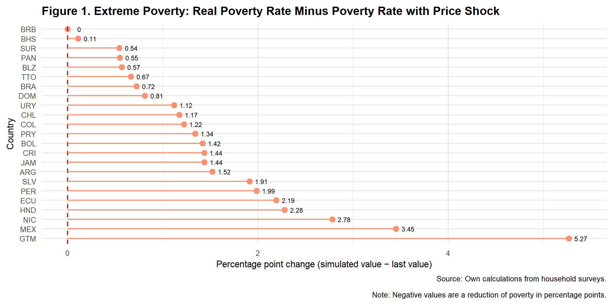

**SCL Data - Data Ecosystem Working Group**

# Rising Food Prices and Poverty in Latin America and the Caribbean:

### Description and Context
This repository contains the code of the *SCL policy simulator tool.* 

- [Shiny app](https://www.iadb.org/en/simulatorpublicpolicy)

- [Code](https://github.com/EL-BID/analytics_simulation_public_policy_scl)

---

# [Introduction](#introduction) 
 
*With food prices rising rapidly this year, concern has grown about the potential impacts on people’s lives—particularly about higher poverty levels and the welfare of the most economically vulnerable populations. We know that previous periods of food price hikes have resulted in large increases in extreme poverty.* Between 2006 and 2008, the price of rice increased by 217 percent, wheat by 136 percent, and maize by 125 percent, among other price increases (Ramalingam, Proudlock and Mitchell, 2008). As a result, an estimated 155 million people were pushed into extreme poverty worldwide (de Hoyos and Medvedev, 2011). In Latin America and the Caribbean (LAC), estimates during that period show poverty increases of 4.3 percentage points, affecting 21 million people (UN, 2011).

Midway through 2022, food and commodity prices worldwide have been affected by the combination of the conflict between Russia and Ukraine and factors such as [increased demand from Asia](https://www.fas.usda.gov/data/ukraine-conflict-and-other-factors-contributing-high-commodity-prices-and-food-insecurity#:~:text=Russia's%20invasion%20of%20Ukraine%20comes,prices%20are%20up%2090%20percent.). [Russia and Ukraine represent 28.5 percent of the world’s wheat exports](https://oec.world/en/profile/hs92/wheat), and Russia is currently the world’s [third-largest oil producer](https://www.iea.org/reports/russian-supplies-to-global-energy-markets/oil-market-and-russian-supply-2) and the [leading exporter of fertilizer](https://oec.world/en/profile/bilateral-product/fertilizers/reporter/rus#:~:text=About,-%23permalink%20to%20section&text=Exports%20In%202020%2C%20Russia%20exported,most%20exported%20product%20in%20Russia). Therefore, the conflict between Russia and Ukraine is expected to continue to raise food prices and affect vulnerable populations, particularly households with low food basket substitution power. The most recent figures from the Food and Agriculture Organization (FAO) show about a 20 percent increase on the [Food Price Index](https://www.fao.org/worldfoodsituation/foodpricesindex/en/) and 15 percent increase on the Cereal Price Index since last year. The FAO also warns of the risk of further increments of food prices from 8 to 22 percent (FAO, 2022a). 

**The Inter-American Development Bank (IDB) developed a [publicly available simulation tool](https://www.iadb.org/en/simulatorpublicpolicy.) that estimates the likely impacts in 2022 on poverty levels for 23 LAC countries from food price increases related to the war in Ukraine.** Because policy that mitigates the effects of exogenous shocks has to be designed and implemented with an understanding shocks’ impacts and location and the characteristics of the population most affected by them, the simulation tool allows the user to manipulate these factors. This policy brief explains how the simulation tool can be used to predict the likely impacts on LAC’s poverty levels by adjusting national poverty lines according to projected price increases of key food items (grains, breads, cereals, and meats). It also shows how the resulting simulations consider countries’ revised growth projections and account for the share of national producers of these essential food items. 

**In the simulation we ran for the LAC region, we used as inputs the expected 20 percent price increase on all food items except meats  and the revised growth projections from the International Monetary Fund (IMF) for all LAC countries. The results show average increases of 1.6 percentage points in moderate poverty and 1.8 percentage points in extreme poverty—resulting in an additional 9.8 (10.8) million moderate(extreme) poor people in LAC.** Some countries will be more affected than others because of four key factors: (a) the composition of the poverty basket in each country, (b) the income distribution of precrisis household income, (c) the impact of the crisis on growth prospects, and (d) the share of food producers in each country. In our simulations, the countries with the largest percentage point increase in extreme poverty will be Guatemala, Mexico and Nicaragua.  

**The regional simulation also makes it evident that compensating families in LAC for the loss of purchasing power could be costly, so we provide lessons learned from past food price hikes and the COVID pandemic as well as policy options for the current crisis.** Notably, we find that a naive transfer large enough to return all families below the moderate poverty line to their precrisis income levels (and therefore, to precrisis moderate poverty levels) would cost the region 0.41 percent of GDP. 

*This policy brief is laid out as follows:** Section 1 explains the simulation tool’s purpose and provides a basic overview of its operations so that anyone can use the tool to run their own scenarios. Section 2 explains the results of the simulation we ran to determine how poverty levels in 23 LAC countries will be affected by food price increases in 2022. Section 3 discusses some policy lessons learned from the 2008 food price crisis and the COVID-19 pandemic that can inform current policy decisions, and section 4 proposes policy options for the present crisis. Finally, note that appendix A fully explains the simulation tool’s methodology so other scenarios can be run.

## 1. How the Simulation Tool Estimates the Effects of Higher Food Prices on Poverty 

**The simulation tool was designed to show how poverty levels for 23 countries in LAC will be affected in 2022 by food price increases caused by the Ukraine war.**  Starting with the most recently available poverty level data from each country (see appendix A for details), we adjust poverty lines to reflect the changes in prices while simultaneously increasing household income in line with revised GDP growth projections. Additionally, to reflect that some countries will benefit from the crisis because they are producers of the affected goods, we allow the simulation to shield these populations from the price increases. Three factors were included to positively and negatively impact households:

-	**Changes to poverty lines.** We simulate the direct effect of the increase in food prices by increasing the poverty lines of LAC countries. Each country's poverty line is adjusted by the percentage that each commodity represents in the poverty line. For example, if there is an increment of 20 percent in the price of wheat and wheat represents 20 percent of the basket used to calculate the county's poverty line, the increment in the poverty line is 4 percent. 

-	**Impact of growth on poverty.** To account for the aggregate impact of growth on poverty, we use IMF growth forecasts (the most recent data are from April 2022) in the simulations. This channel will generate variation across countries, as the commodity shocks will impact countries differently depending on whether they are net commodity exporters or importers. The assumption for simulating GDP growth on poverty was that all incomes in the country grow at the same rate as GDP growth. While growth distributions tend to vary depending on which years are being analyzed, the assumption seems to be backed by [World Bank](https://www.worldbank.org/en/topic/poverty/lac-equity-lab1/economic-growth/growth-incidence-curve#:~:text=The%20Growth%20Incidence%20Curve%20(GIC,between%20two%20points%20in%20time)  measurements of growth distribution curves, except for the bottom decile. For the bottom decile in the region, growth has tended to be less beneficial than for the others. 

-	**Share of producers in countries.** Similarly, within countries, we account for the fact that some households benefit from increases in prices by shielding those households that are involved in agricultural activities. We consider that households that have either a self-employed or an employer involved in agricultural activities will not experience changes in income.

**There are important caveats to consider when interpreting the results of simulations produced by this tool.** We currently assume that increases in international prices are fully passed through to observed household prices. We do not consider substitution effects among the products consumed by a household for practical reasons since these in turn would trigger (likely) smaller increases in prices of substitute goods or changes in income caused by changes in food prices through agricultural wages. We do not analyze consumption patterns at the micro level since most surveys used do not have detailed information on consumption.

**This tool is designed to simulate several scenarios.** Our baseline scenario considers an increase of 20 percent in the prices of all food items except for meat, in line with the most recent forecasts from the FAO (see appendix A) and the April 2022 IMF growth projections, and we assume that local producers are shielded from price increases. We allow for changes in the goods that are affected by price inflation (all products; all but meat; grains, bread, and cereals; and only grains) as well as the size of the shock, from a 10 percent to a 50 percent increase in prices. We also allow the user to turn off the impact of growth on poverty and indicate whether producers are affected by the price increases. By turning off the checkbox on these two factors, the simulations reflect the direct impact of increases in prices on poverty lines. 

**We invite you to run your own scenarios using the simulation tool developed by the IDB:** 

- [https://www.iadb.org/en/simulatorpublicpolicy](https://www.iadb.org/en/simulatorpublicpolicy)

- [Code](https://github.com/EL-BID/analytics_simulation_public_policy_scl)

### Limitation of responsibilities
---
The IDB is not responsible, under any circumstance, for damage or compensation, moral or patrimonial; direct or indirect; accessory or special; or by way of consequence, foreseen or unforeseen, that could arise:

I. Under any concept of intellectual property, negligence or detriment of another part theory; I
ii. Following the use of the Digital Tool, including, but not limited to defects in the Digital Tool, or the loss or inaccuracy of data of any kind. The foregoing includes expenses or damages associated with communication failures and / or malfunctions of computers, linked to the use of the Digital Tool.
