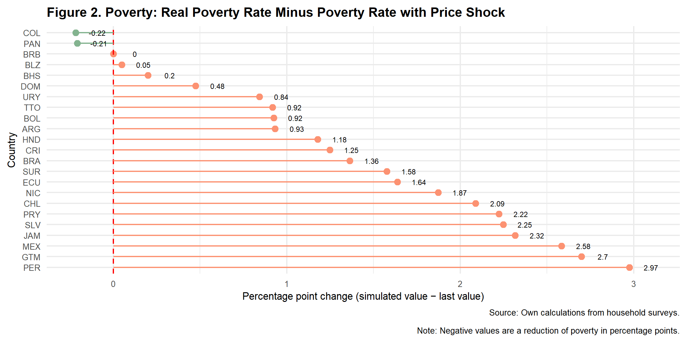

**SCL Data - Data Ecosystem Working Group**

# How Rising Food Prices Affect Poverty in Latin America and the Caribbean: Using A Simulation Tool to Determine Impacts

_Arias Lina; Bosch Mariano; Goyeneche Laura; Sanchez A. Roberto; Tejerina Luis; Torres Eric_

# [Introduction](#introduction) 
 
*With food prices rising rapidly this year, concern has grown about the potential impacts on people’s lives—particularly about higher poverty levels and the welfare of the most economically vulnerable populations. We know that previous periods of food price hikes have resulted in large increases in extreme poverty.* Between 2006 and 2008, the price of rice increased by 217 percent, wheat by 136 percent, and maize by 125 percent, among other price increases (Ramalingam, Proudlock and Mitchell, 2008). As a result, an estimated 155 million people were pushed into extreme poverty worldwide (de Hoyos and Medvedev, 2011). In Latin America and the Caribbean (LAC), estimates during that period show poverty increases of 4.3 percentage points, affecting 21 million people (UN, 2011).

Midway through 2022, food and commodity prices worldwide have been affected by the combination of the conflict between Russia and Ukraine and factors such as [increased demand from Asia](https://www.fas.usda.gov/data/ukraine-conflict-and-other-factors-contributing-high-commodity-prices-and-food-insecurity#:~:text=Russia's%20invasion%20of%20Ukraine%20comes,prices%20are%20up%2090%20percent.). [Russia and Ukraine represent 28.5 percent of the world’s wheat exports](https://oec.world/en/profile/hs92/wheat), and Russia is currently the world’s [third-largest oil producer](https://www.iea.org/reports/russian-supplies-to-global-energy-markets/oil-market-and-russian-supply-2) and the [leading exporter of fertilizer](https://oec.world/en/profile/bilateral-product/fertilizers/reporter/rus#:~:text=About,-%23permalink%20to%20section&text=Exports%20In%202020%2C%20Russia%20exported,most%20exported%20product%20in%20Russia). Therefore, the conflict between Russia and Ukraine is expected to continue to raise food prices and affect vulnerable populations, particularly households with low food basket substitution power. The most recent figures from the Food and Agriculture Organization (FAO) show about a 20 percent increase on the [Food Price Index](https://www.fao.org/worldfoodsituation/foodpricesindex/en/) and 15 percent increase on the Cereal Price Index since last year. The FAO also warns of the risk of further increments of food prices from 8 to 22 percent (FAO, 2022a). 

**The Inter-American Development Bank (IDB) developed a [publicly available simulation tool](https://www.iadb.org/en/simulatorpublicpolicy) that estimates the likely impacts in 2022 on poverty levels for 23 LAC countries from food price increases related to the war in Ukraine.** Because policy that mitigates the effects of exogenous shocks has to be designed and implemented with an understanding shocks’ impacts and location and the characteristics of the population most affected by them, the simulation tool allows the user to manipulate these factors. This policy brief explains how the simulation tool can be used to predict the likely impacts on LAC’s poverty levels by adjusting national poverty lines according to projected price increases of key food items (grains, breads, cereals, and meats). It also shows how the resulting simulations consider countries’ revised growth projections and account for the share of national producers of these essential food items. 

**In the simulation we ran for the LAC region, we used as inputs the expected 20 percent price increase on all food items except meats  and the revised growth projections from the International Monetary Fund (IMF) for all LAC countries. The results show average increases of 1.6 percentage points in moderate poverty and 1.8 percentage points in extreme poverty—resulting in an additional 9.8 (10.8) million moderate(extreme) poor people in LAC.** Some countries will be more affected than others because of four key factors: (a) the composition of the poverty basket in each country, (b) the income distribution of precrisis household income, (c) the impact of the crisis on growth prospects, and (d) the share of food producers in each country. In our simulations, the countries with the largest percentage point increase in extreme poverty will be Guatemala, Mexico and Nicaragua.  

**The regional simulation also makes it evident that compensating families in LAC for the loss of purchasing power could be costly, so we provide lessons learned from past food price hikes and the COVID pandemic as well as policy options for the current crisis.** Notably, we find that a naive transfer large enough to return all families below the moderate poverty line to their precrisis income levels (and therefore, to precrisis moderate poverty levels) would cost the region 0.41 percent of GDP. 

*This policy brief is laid out as follows:** Section 1 explains the simulation tool’s purpose and provides a basic overview of its operations so that anyone can use the tool to run their own scenarios. Section 2 explains the results of the simulation we ran to determine how poverty levels in 23 LAC countries will be affected by food price increases in 2022. Section 3 discusses some policy lessons learned from the 2008 food price crisis and the COVID-19 pandemic that can inform current policy decisions, and section 4 proposes policy options for the present crisis. Finally, note that appendix A fully explains the simulation tool’s methodology so other scenarios can be run.

## 1. How the Simulation Tool Estimates the Effects of Higher Food Prices on Poverty 

**The simulation tool was designed to show how poverty levels for 23 countries in LAC will be affected in 2022 by food price increases caused by the Ukraine war.**  Starting with the most recently available poverty level data from each country (see appendix A for details), we adjust poverty lines to reflect the changes in prices while simultaneously increasing household income in line with revised GDP growth projections. Additionally, to reflect that some countries will benefit from the crisis because they are producers of the affected goods, we allow the simulation to shield these populations from the price increases. Three factors were included to positively and negatively impact households:

-	**Changes to poverty lines.** We simulate the direct effect of the increase in food prices by increasing the poverty lines of LAC countries. Each country's poverty line is adjusted by the percentage that each commodity represents in the poverty line. For example, if there is an increment of 20 percent in the price of wheat and wheat represents 20 percent of the basket used to calculate the county's poverty line, the increment in the poverty line is 4 percent. 

-	**Impact of growth on poverty.** To account for the aggregate impact of growth on poverty, we use IMF growth forecasts (the most recent data are from April 2022) in the simulations. This channel will generate variation across countries, as the commodity shocks will impact countries differently depending on whether they are net commodity exporters or importers. The assumption for simulating GDP growth on poverty was that all incomes in the country grow at the same rate as GDP growth. While growth distributions tend to vary depending on which years are being analyzed, the assumption seems to be backed by [World Bank](https://www.worldbank.org/en/topic/poverty/lac-equity-lab1/economic-growth/growth-incidence-curve#:~:text=The%20Growth%20Incidence%20Curve%20(GIC,between%20two%20points%20in%20time. ) measurements of growth distribution curves, except for the bottom decile. For the bottom decile in the region, growth has tended to be less beneficial than for the others. 

-	**Share of producers in countries.** Similarly, within countries, we account for the fact that some households benefit from increases in prices by shielding those households that are involved in agricultural activities. We consider that households that have either a self-employed or an employer involved in agricultural activities will not experience changes in income.

**There are important caveats to consider when interpreting the results of simulations produced by this tool.** We currently assume that increases in international prices are fully passed through to observed household prices. We do not consider substitution effects among the products consumed by a household for practical reasons since these in turn would trigger (likely) smaller increases in prices of substitute goods or changes in income caused by changes in food prices through agricultural wages. We do not analyze consumption patterns at the micro level since most surveys used do not have detailed information on consumption.

**This tool is designed to simulate several scenarios.** Our baseline scenario considers an increase of 20 percent in the prices of all food items except for meat, in line with the most recent forecasts from the FAO (see appendix A) and the April 2022 IMF growth projections, and we assume that local producers are shielded from price increases. We allow for changes in the goods that are affected by price inflation (all products; all but meat; grains, bread, and cereals; and only grains) as well as the size of the shock, from a 10 percent to a 50 percent increase in prices. We also allow the user to turn off the impact of growth on poverty and indicate whether producers are affected by the price increases. By turning off the checkbox on these two factors, the simulations reflect the direct impact of increases in prices on poverty lines. 

**We invite you to run your own scenarios using the simulation tool developed by the IDB:** https://www.iadb.org/en/simulatorpublicpolicy.

## 2. Results of the LAC Simulation

*In our baseline scenario, moderate (extreme) poverty will increase by 1.6 (1.8) percentage points, increasing the number of people below the moderate(extreme) poverty line by 9.8(10.8) million.** The effect of the simulation is larger on extreme poverty because the extreme poverty line is mostly made up of food prices, so the increase will be larger compared to the moderate poverty line. The relatively small effect is due to the combination of the GDP growth effect and the effect of the increase in food prices that act in different directions. Among the countries that are expected to be hit the hardest are Ecuador, Guatemala, Honduras, Mexico, and Nicaragua, all of which have poverty rate increases of more than two percentage points in extreme poverty.

A naive transfer large enough to compensate all poor households to maintain a situation similar to that from before the crisis would cost the region 0.4 percent of GDP. This outlook is particularly worrisome after the efforts made by countries in the region to support households in the face of COVID-19. Efforts to help households cope with the pandemic cost 3.5 percent of GDP [in 2020, and growth forecasts are expected to slow from 6.2 percent in 2021 to 2.1 percent in 2022 (CEPAL, 2022).](https://www.cepal.org/es/comunicados/america-latina-caribe-desacelerara-su-crecimiento-21-2022-medio-importantes-asimetrias#:~:text=La%20regi%C3%B3n%20de%20Am%C3%A9rica%20Latina,entregadas%20hoy%20por%20la%20CEPAL.)

*In a more extreme scenario, in which inflation keeps going up and reaches 50 percent , the change to the number of people in poverty would be dramatic.** Poverty would rise by 5.5 percentage points and extreme poverty by 5.6 points. This would add a staggering 30 (34.7) million people into moderate (extreme) poverty and cost the region 1.15 percent of GDP to compensate.

The distribution of the effect in our baseline scenario by country can be seen in Figure 1. A more complete view of different inflation scenarios can also be seen in Figure A1 in appendix A. The result for the same exercise on moderate poverty can be seen on figures 2 and 2A in the appendix.

## 3. Policy Lessons from the 2008 Food Price Crisis and the COVID-19 Pandemic

*In LAC in 2008, countries including Brazil, Chile, Jamaica, and Mexico adjusted their conditional cash transfer (CCT) programs to help the poor cope with food price increases.** Mexico’s Oportunidades CCT program increased its monthly transfer amount by $120 Mexican pesos (about US$10) per household in 2008 to compensate its beneficiaries for purchasing-power losses during the economic downturn that followed the global financial crisis. Jamaica increased its individual cash subsidies from J$530 to J$650,  and, beginning in June 2008, expanded the total number of beneficiaries of its Program for Advancement through Health and Education from 245,000 to 360,000 (Johannsen, Tejerina and Glassman. 2009). Brazil increased the basic Bolsa Familia benefit in July 2008 by 8 percent and the transfer per child by 13 percent. The latter was in marked contrast with the measures taken during the COVID-19 pandemic in 2020–2021, when more than 100 new transfer programs were implemented (Cejudo et al., 2021) in the region to cope with the temporary systemic shocks. Subsequent evaluations of the measures taken in 2008 showed that while the response was not large enough to fully protect the poorest people, it did ameliorate the impact of price increases for them (World Bank, 2014). 

*Other measures were taken in 2008 to limit the impact of the increase in food prices.** While some countries were able to scale up safety net programs that delivered both cash and in-kind support to families, countries also used a mix of other measures. Many countries in 2008 resorted to a combination of restricting exports, liberalizing imports, removing sales taxes, and providing fertilizer subsidies. 

*Scaling up social programs was generally deemed to be more efficient, and, in particular, unconditional cash transfers, but such programs need to be closely indexed to food prices and adjusted accordingly.** Other measures like export restrictions caused more harm than good,2 as they were one of the causes of price increases in the first place. However, measures such as tariff reductions did produce some positive effects (World Bank, 2013). Some in-kind transfers were found to have had positive impacts (school meals in Nicaragua, for example). Cash transfers have been more efficient (Hidrobo, Peterman and Heise, 2016), as food transfers have been found to cost 20 percent of the cost of the transfer versus 2.4 percent with cash (IDB, 2018). 

*Since then, countries have developed the capacity to more efficiently react to income shocks.** During the COVID-19 pandemic, countries were better prepared for income shocks, and many more of them used their social registry information systems to identify people potentially affected (among other tools such as web-based application forms) and reach out to them with cash transfers (in Colombia, Costa Rica, the Dominican Republic, and Honduras, for example). 

*One of the concerns during the 2008 food price crisis was that temporary measures such as temporary increases or one-off transfers could become permanent.** Some of the transfers that were put in place during 2008 did in fact become permanent features of programs (in Mexico, for example). During the COVID-19 pandemic, however, it was possible to implement temporary transfers without creating expectations from the population. One means of achieving this was to have a good communication strategy to make the rules of the transfer clear to the population as soon as the transfer was publicly announced.

*Distributional impacts within countries matter.** It is also important to consider gender sensitivity to make sure there is no unequal distribution of transfers within the household. Anecdotal evidence found the greatest consumption losses falling on women and girls, although CCTs have a culture of providing transfers to women in the household. Food-producing households (but not the entire population), may have received some benefits from the food price crisis, but the net effect is harder to measure because input prices such as fertilizer also went up and it is not clear how much of the protection was passed through to employees in food-producing industries. Estimations of the amounts to be given need to consider the large heterogeneity between and within countries and urban and rural areas focusing on those who are most affected.

*Today, the region has better instruments to compensate households for income shocks. **The COVID-19 pandemic taught us that when there are no safety net tools present, new technologies can be used to react quickly to help poor households—but at the cost of less efficiency in targeting and accountability of who receives what (Andrade, Bagolle and Tejerina, 2020). There is no substitute for building strong, well-informed social safety nets with adequate governance before a new crisis hits. 

## 4. Policy Options for the Present Crisis

The current food price crisis represents an important challenge to countries in our region, but it is different from the COVID-19 situation in that there is no large-scale shutdown of the economy, so policy options can be more targeted. At the same time, the population in need of support goes beyond the people currently registered in social programs, and in many cases, coverage is insufficient to cover even the precrisis households in extreme poverty. For example, the coverage of CCT programs in the region is approximately 65 percent of households, and coverage for the moderately poor is 42 percent. We also need to consider the new poor created by the pandemic, most of whom have not been included in CCT programs. Some options for addressing the crisis follow.

*Use the existing programs.** One option would be to do as Brazil, Jamaica, and Mexico did, and expand benefits to existing beneficiaries of cash transfers. This can be done quickly and would likely reach those households most in need of help; however, the transfer would run the risk of becoming permanent (although this is not necessarily a bad thing in programs in which the benefit has eroded because of past inflation), and there would be undercoverage of poor households.

*Use the existing, installed capacity for new programs.** Another option is to use the information available in social registries and provide a transfer to a larger group of households (i.e., all households in the registry that are below the poverty line). This will include those households already in social programs and those outside of them. Existing payment mechanisms can be used (bank accounts, when available, for example) for those enrolled in the programs, and simplified methods can be used for those not enrolled (like the type of PINs used in Guatemala, for example). Using a new transfer to reach a larger group than current beneficiaries would not be as fast as reaching existing beneficiaries, but doing so would reach a wider population and be easier to control in the medium term (as the transfer would not become permanent).

*In-kind transfers and other options. ** As discussed previously, in-kind transfers can be an option and can reach people in need. However, in similar scenarios, in-kind transfers are less efficient and hence would reach fewer households or deliver smaller benefits for the same budget. Using in kind transfers needs to be linked to any efforts done on the supply side with the agricultural sector. Whatever the options chosen, LAC is better prepared now to face a crisis like the one it did in 2008, and it is up to us to choose the right instruments and use the crisis as an opportunity to make our social protection systems even stronger.

# [References](#references) 

- Andrade, G., A. Bagolle and L. Tejerina. 2020. Los mecanismos de pago digitales: Una guía para los proyectos de protección social durante pandemias. Washington, DC, United States: IDB. http://dx.doi.org/10.18235/0002293.
- CEPAL (Economic Commission for Latin America and the Caribbean). 2022. “América Latina y el Caribe desacelerará su crecimiento a 2,1% en 2022 en medio de importantes asimetrías entre países desarrollados y emergentes.” https://www.cepal.org/es/comunicados/america-latina-caribe-desacelerara-su-crecimiento-21-2022-medio-importantes-asimetrias#:~:text=La%20regi%C3%B3n%20de%20Am%C3%A9rica%20Latina,entregadas%20hoy%20por%20la%20CEPAL.
- Cejudo,  G.  M.,  de  los  Cobos,  P.,  Michel,  C.  L., y Ramírez ,  D.  L.  (2021). I nventario y caracterización de los programas de apoyo al ingreso en América Latina y el Caribe frente a COVID - 19. Inter - American Development Bank Technical Note No. 2334 (IDB - TN - 02334). https://publications.iadb.org/es/inventario-y-caracterizacion-de-los-programas-de-apoyo-al-ingreso-en-america-latina-y-el-caribe 
- de Hoyos, R.E., and D. Medvedev. 2011. “Poverty Effects of Higher Food Prices: A Global Perspective.” Review of Development Economics 15:387–402. https://doi.org/10.1111/j.1467-9361.2011.00615.x.
- FAO (Food and Agriculture Organization). 2022a. “The Importance of Ukraine and the Russian Federation for Global Agricultural Markets and the Risks Associated with the Current Conflict.” Information note. Rome, Italy: FAO. https://www.fao.org/fileadmin/user_upload/faoweb/2022/Info-Note-Ukraine-Russian-Federation.pdf.
- FAO (Food and Agriculture Organization). 2022b. World Food Situation. April 7. Rome, Italy: FAO. https://www.fao.org/worldfoodsituation/foodpricesindex/en/.
- Hidrobo, M., A. Peterman and L. Heise. 2016. “The Effect of Cash, Vouchers, and Food Transfers on Intimate Partner Violence: Evidence from a Randomized Experiment in Northern Ecuador,” American Economic Journal: Applied Economics 8(3): 284–303. https://www.aeaweb.org/articles/pdf/doi/10.1257/app.20150048. 
- IDB (Inter-American Development Bank). 2018. Food Sector Security Framework Document. July. Washington, DC, United States: IDB.
- Johannsen, J., L. Tejerina and A. Glassman. 2009. Conditional Cash Transfer Programs in Latin America: Problems and Opportunities. Washington, DC, United States: Inter-American Development Bank.
- Laborde, D., C. Lakatos and W.J. Martin. (2019). ”Poverty Impact of Food Price Shocks and Policies.” World Bank e-Library Series. Washington, DC, United States: World Bank. http://elibrary.worldbank.org/doi/book/10.1596/1813-9450-8724.
- Ramalingam, B., K. Proudlock and J. Mitchell. 2008. The Global Food Price Crisis: Lessons and Ideas for Relief Planners and Managers. London, United Kingdom: ALNAP.
- UN (United Nations). 2011. Report on the World Social Situation 2011: The Global Social Crisis. New York, United States: UN.
- World Bank. 2013. “Global Food Crisis Response Program.” April 11. https://www.worldbank.org/en/results/2013/04/11/global-food-crisis-response-program-results-profile. 
- World Bank. 2014. High Food Prices: Latin America and the Caribbean Responses to a New Normal. License: CC BY 3.0 IGO. Washington, DC, United States: World Bank. https://openknowledge.worldbank.org/bitstream/handle/10986/18639/879320WP0Box38000FoodPrices0english.pdf?sequence=1&isAllowed=y.

# [Appendix A. Simulation Tool Methodology: Putting the Tool to Work	](#appendixa) 

# A1. Harmonizing Household Surveys
Household surveys are the instruments used to analyze poverty and inequality. The first step we took in developing the tool was to work on creating a harmonized household-level data set for 23 countries in the region. The list of countries, household surveys, year of data collection, and sample sizes are reported in Table A1.

## A1.1. Income and Consumption 
Given that the objective of the simulation tool is to analyze the impact of price variation on national poverty rates, it was essential to replicate and harmonize its construction across all countries in the region. To achieve this, the main preprocessing work involved the reconstruction of each country's official per capita income/consumption methodology. In LAC most countries use household income to measure poverty rates against a welfare line. However, some countries prefer per capita consumption, arguing that consumption fluctuates less over time than income, keeping results more comparable over time (IDB, 2018). This is the case for countries such as Barbados, Peru, and Suriname.
When official per capita income is not available, the harmonized variables calculated by the IDB team are used.

# A.2 Poverty lines
In order to replicate the official poverty of each country, it is also necessary to use the official poverty thresholds. To define them, most countries use the concept of the basic food and non-food basket. On the one hand, the basic food basket establishes the minimum economic threshold to satisfy food needs based on the consumption habits of households in each country; if a family is below this threshold, it is defined as extremely poor. On the other hand, the non-food basic basket adds non-food components to the basic basket; this threshold is used to identify the population living in poverty.

Due to lack of information, it was not possible to replicate all the national poverty figures. in these cases, international poverty lines were used. To make the lines comparable with the national income of the year of the survey they are adjusted and deflated with the Consumer Price Index (CPI) and the Purchasing Power Parity - PPP.

Equation (1) is used to calculate the countries' monthly international poverty lines per person for international poverty lines. In this line, PPP data are from the World Bank's World Development Indicators (WDI), and CPI data are from the International Monetary Fund's (IMF) World Economic Outlook (WEO) database. 

$$
lp_{ci}=(lp∗\frac{365}{12})∗[PPP_{2011} ∗ \frac{PCI_{year_{i}}}{PCI_{2011}}]
$$

# A.3 Household Food Basket Composition

In order to focus the price increase on specific commodities, we consider the relative weight of each component in the basic food basket. We use the Economic Commission for Latin America and the Caribbean' (CEPAL, acronym in Spanish) Basic Food Basket. They use the Expenditure Household Surveys to obtain the expenditure and the consumer of the household. In this line, the CEPAL generates the Basic Food Basket choosing a limited number of products that represent the consumption of households.

The products are initially classified into 14 categories: 1. Grains; 2. Bread and cereals; 3. Legumes; 4. Vegetables (greens or vegetables); 5. Roots and tubers; 6. Fruits; 7. Sugars; 8. Fats and oils; 9. Milk and dairy products; 10; 10. Meat, poultry, fish, seafood, and eggs; 11; 11. Non-alcoholic beverages; 12. Alcoholic beverages; 13. Food products not previously specified; 14. Meals and beverages outside the home. In the dataset, they report the quantities and the calories per capita (CEPAL, p. 49, 2018)

## A.3.1 Identification of food-producers

As part of the simulation exercise, we assume that the effects of the market imbalance caused by the invasion have had a heterogeneous impact on the economic sectors. Therefore, as a first approximation, we consider the food-production sector.

In this subsection, our goal is to identify within the household and employment surveys those individuals who produce food or who otherwise perform tasks closely linked to the agricultural sector (whether they have agriculture as their main or secondary activity). First, we identified all workers who are business owners or self-employed. From this group, only those in the agricultural sector are identified. As a result, we have a column that gives values equal to 1 to employers and self-employed who belong to the agricultural sector and 0 to the rest.

## A.3.2 GDP Growth

Rising food prices could affect real household incomes, at the same time, the economic growth of countries also has the potential to affect them directly and indirectly. (Laborde et al., 2019). To control for this effect, we use the International Monetary Fund (IMF) economic growth projections for the year 2022. In this phase of the project we impact the income of all households in each country with the same weighting.

# A.4 Poverty lines adjustment

The simulation of increases in the poverty line works by adjusting the proportion of the poverty line that is composed of the commodities in each country that were affected by the price spike according to the following formula:

$$
povertyline\Delta_{country_i} =  povertyline_{country_i} * (1 - \omega_{country_i} ) + \\
                                 povertyline_{country_i} * \omega_{country_i} * (1 + shock\_weight)
$$

Figure A1. Distribution o changes in poverty for different changes in prices in all food except for meat.

# Tables and figures

Table A1. Simulation Data Sources by Country

| Country 	| year 	|                                             Survey                                            	| National poverty lines 	| Official   income/consumption  	|  Income/Consumption 	|
|:-------:	|:----:	|:---------------------------------------------------------------------------------------------:	|:----------------------:	|:------------------------------:	|:-------------------:	|
|   ARG   	| 2020 	| Permanent Continuous Household Survey (EPHC acronym in Spanish)                               	|           Yes          	|               Yes              	|    Monthly income   	|
|   BHS   	| 2014 	| Labor Force & Household Survey                                                                	|           No           	|               No               	|    Monthly income   	|
|   BLZ   	| 2007 	| Labor Force & Household Survey                                                                	|           No           	|               No               	|    Monthly income   	|
|   BOL   	| 2020 	| Household Survey (ECH, acronym in Spanish)                                                    	|           Yes          	|               Yes              	|    Monthly income   	|
|   BRA   	| 2020 	| Brazilian National Household Sample Survey (PNADC, acronym in Potuguese)                      	|           Yes          	|               No               	|    Monthly income   	|
|   BRB   	| 2016 	| Labor Force & Household Survey                                                                	|           Yes          	|               No               	| Monthly consumption 	|
|   CHL   	| 2020 	| National Socioeconomic Characterization Survey (CASEN, acronym in   Spanish)                  	|           Yes          	|               Yes              	|    Monthly income   	|
|   COL   	| 2020 	| Large Integrated Household Survey (GEIH, acronym in Spanish)                                  	|           Yes          	|               Yes              	|    Monthly income   	|
|   CRI   	| 2021 	| National Household Survey (ENAHO, acronym in Spanish)                                         	|           Yes          	|               Yes              	|    Monthly income   	|
|   DOM   	| 2020 	| Continuous National Labor Force Survey (ENCFT, acronym in Spanish)                            	|           Yes          	|               Yes              	|    Monthly income   	|
|   ECU   	| 2020 	| National Survey on Employment Unemployment and Underemployment (ENEMDU,   acronym in Spanish) 	|           Yes          	|               Yes              	|    Monthly income   	|
|   GTM   	| 2014 	| National Survey of Living Conditions (ENCOVI, acronym in Spanish)                             	|           Yes          	|               Yes              	|  Annual expenditure 	|
|   HND   	| 2019 	| Permanent Multipurpose Household Survey (EPHPM, acronym in Spanish)                           	|           Yes          	|               Yes              	|    Monthly income   	|
|   JAM   	| 2018 	| Survey of Living Conditions (SLC)                                                             	|           Yes          	|               Yes              	|    Monthly income   	|
|   MEX   	| 2020 	| National Household Income and Expenditure Survey (ENIGH, acronym in   Spanish)                	|           Yes          	|               Yes              	|    Monthly income   	|
|   NIC   	| 2014 	| Living Standard Measurement Survey (EMNV, acronym in Spanish)                                 	|           Yes          	|               Yes              	| Monthly consumption 	|
|   PAN   	| 2019 	| Multipurpose Survey (EHPM, acronym in Spanish)                                                	|           Yes          	|               No               	|    Monthly income   	|
|   PER   	| 2020 	| National Household Survey (ENAHO, acronym in Spanish)                                         	|           Yes          	|               Yes              	| Monthly consumption 	|
|   PRY   	| 2020 	| Permanent Continuous Household Survey (EPHC acronym in Spanish)                               	|           Yes          	|               Yes              	|    Monthly income   	|
|   SLV   	| 2020 	| Multipurpose Household Survey (EHPM, acronym in Spanish)                                      	|           Yes          	|               Yes              	|    Monthly income   	|
|   SUR   	| 2017 	| Survey of Living Conditions (SLC)                                                             	|           No           	|               No               	| Monthly consumption 	|
|   TTO   	| 2015 	| Continuous Sample Survey of Population (CSSP)                                                 	|           No           	|               Yes              	|    Monthly income   	|
|   URY   	| 2020 	| Continuous Household Survey (ECH, acronym in Spanish)                                         	|           Yes          	|               Yes              	|    Monthly income   	|
